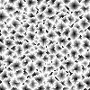

# Day 9 Challenge A & B

Rations are running low. This sub was fitted with at least a month's worth of food by the elves, but it appears that elves consider "food" to be a much broader term than I did. If I crack open a can of frosting to survive I've already lost my humanity.

I've come up on some more hypothermal vents. The heated spew of toxins floats to the top of the cave, and then rains down and covers the ground in a thick layer of ash.

I should probably avoid those, shouldn't I?

## **Code Writeup**

Here's a pretty image of our input:



For part A we just have to find the total number of points that are the "lowest" around them. This requires just 4 simple checks to confirm that the number is the lowest.

Part B can be done at the same time as part A. We have to find the size of the "basin" and store the top three largest. A quirk of the input (which I assume is on purpose) is that every basin has exactly 1 "deepest point".

This means that we don't see stuff like this:

```text
9999
9009
9999
```

or even

```text
999999
901109
999999
```

This means we can create a recursive function that calculates the size of each basin. Because there is only 1 deepest point per basin, we can also fill in the basin with 9s to make our algorithm easier and more efficient.

One loop and one recursive algorithm later we find ourselves done with both A and B.

I think that today was surprisingly easy, it required less thought than day 7 and 8.
